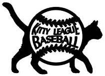
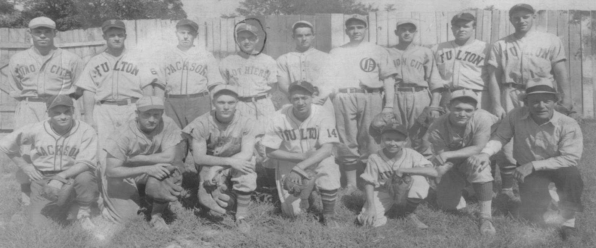

<nav class="breadcrumb" aria-label="breadcrumbs">
  <ul>
    <li><a href="{{ site.url }}{{ site.baseurl }}">Home</a></li>
    <li><a href="../magazine-home.html">Magazine</a></li>
    <li><a href="bi_vol_1_no_2_home.html">Vol. 1, No. 2 - September 2000</a></li>
    <li class="is-active"><a href="#" aria-current="page">Kitty League Baseball</a></li>
  </ul>
</nav>

<section class="storycontent">
  <h1>Kitty League Baseball</h1>
  
<em>by Kevin McCann</em>

  

    <em>"Why, you couldn't get away with that, even in the Kitty League!"</em>
  

  

    Despite the quip of vaudeville comedians to the contrary, it seemed like the players, managers, and even the fans of the Kitty League could indeed get away with practically anything. 
  

  

    Like the feline it was named after, the Kitty League had many lives. It started as the Kentucky-Illinois-Tennessee League in 1903, a Class D league with teams in Paducah, Hopkinsville, Henderson, and Owensboro, Kentucky; Cairo, Illinois; and Clarksville and Jackson, Tennessee. It didn't take long for sportswriters to shorten its name to the "Kitty" League and with a nickname like that, it was hard for fans not to expect quirky plays and equally quirky ballplayers and managers. One character produced in its inaugural season was Hopkinsville catcher Charles "Gabby" Street, who was later known as Walter Johnson's personal catcher with the Washington Senators and caught a ball dropped from the top of the Washington Monument.
  

  

    The league continued for two more seasons until a yellow fever epidemic shortened its 1905 campaign, then it returned the following season. After a four-year hiatus, it was brought back in 1910 but disbanded in mid-season four years later. The league was dormant for one year and returned in 1916, then disbanded once again in early August. It was six more years before the Kitty sprang forth with its fourth life in 1922, but a disputed second-half championship and hard feelings among the clubs ended it just two years later.
  

  

    The Kitty League enjoyed an eight-year span in its fifth life from 1935 until wartime travel restrictions and low finances ended it in 1942. Disputed championships, teams violating the league rule limiting the number of veteran players on a club's roster, and no post-season playoffs marked its first two seasons. Longtime president Dr. Frank H. Bassett of Hopkinsville, who led two of its revivals, was ousted during league meetings in the winter of 1937 and replaced by J.E. Hannephin of Fulton, Kentucky. After one season, Ben F. Howard of Union City, Tennessee replaced him for the 1939 and 1940 seasons. Vice-President Shelby Peace of Hopkinsville took the league helm in 1941 and continued until its ultimate demise in 1955.
  

  

    The circuit had its longest and most successful run of ten years between 1946 and 1955. It enjoyed the renewed popularity of minor league baseball after World War II, boasting total attendance figures of 350,000 or more in at least two consecutive seasons (1947-48). The Owensboro Oilers, pennant winners three times during the period, consistently led the league in attendance at their showcase ballpark, Miller Field, which Joe DiMaggio once described as "the best minor league ballpark in the United States." But a combination of air-conditioned homes, drive-in theatres, television, and radio broadcasts of major league games drew fewer and fewer fans to the Kitty ballparks. Attendance was cut in half during its final season, falling from 241,266 in 1954 to 120,187, a far cry from the 361,085 figure eight years earlier.
  

  

    Throughout its thirty-year history, the Kitty League played Class D baseball, which meant that its teams had a meager salary cap, a limited number of experienced players, and many more inexperienced ones just off the sandlots or out of high school. But that didn't stop many club owners from bending the rules with under-the-table funds to supplement their star players' salaries. Especially during the early years, the teams depended upon subscriptions from local fans to finance its operations. Often such promises made during a spirited community drive went unfulfilled and led to a more limited budget than club officials originally conceived.
  

  

    Baseballs were a precious commodity among the penny-pinching clubs around the circuit. It was not uncommon for club owners to compete with local youngsters in pursuit of foul balls that made their way outside the ballpark. The visiting Mayfield (KY) Browns once lodged a protest with the league when they were unable to warm up a relief pitcher because the home team's supply had dwindled to two balls by the fifth inning. When Hopkinsville (KY) Hoppers hurler Johnny Schmitz was denied a new baseball to use, he promptly heaved the game-worn ball up and over the grandstand. He was tossed out of the game, the home plate umpire later explained, because "Hoptown had more pitchers...but that happened to be the only baseball we had right then."
  

  

    There were many colorful characters that for one amusing incident or freak play became legends on Kitty League diamonds. William "Buster" Brown was a 250-pound veteran first baseman known for his powerful swing. During a dispute with an umpire in 1922, he spit tobacco juice in the official's eyes. When he cried out for water, Buster dumped a bucket of water on his head. Delmar Yount, a 6'-6" right-hander for the Union City (TN) Greyhounds, once came out of his pants while sliding into third base and had to be encircled by his teammates to return to the dressing room.
  

  

    In his rookie season, Hopkinsville hurler Victor "Deacon" Delmore&mdash;who later became a National League umpire&mdash;decided to go rabbit hunting from the mound. With a runner on second, he spotted a rabbit scampering across the outfield headed toward third and fired the ball at it. The target went unscathed and the runner rounded third and headed home. After discussing the situation, the home plate umpire ruled that the run didn't count and instructed the runner to return to second. The opposing manager was livid and asked how the arbiter came to such a conclusion. "Well, I don't find anything about it in the rule book," he replied. "But the Kitty League's a character, and I want it to stay this way."
  

  

    The managers were just as colorful as the players. "Red" Smith, who managed Hopkinsville in 1937 and 1938, once entered a game as a pinch-hitter. The first pitch was wide of the plate, but the umpire called it a strike. The Hoppers skipper placed his bat on the plate and from the stands it naturally appeared that he was questioning the call, spreading his arms apart to note how wide the pitch actually was and getting support from the hometown fans. The next pitch was much like the first and it was also ruled a strike. Smith repeated his animated display, once again bringing the fans' wrath down upon the arbiter. "Red, I don't care how big a fish you caught," he finally told the manager. "I can't throw you out of the game because you haven't cussed or touched me. But if you say one more word about that fish, I'm going to fine you for inciting a riot."
  

  

    It isn't very often that a manager walks away from a dispute with an umpire speechless, but it happened to Hopkinsville manager John Henry Suther in 1935. After one of his players was called out on the base paths, the former University of Alabama football star disagreed with the call and began his tirade. But just as quickly as he had started, Suther returned meekly to the dugout without another word. When questioned about his abrupt departure, he explained: "The ump asked, 'Don't you know the rule?' So I said, 'What rule?' And that umpire said, 'The Kitty League rule that says the home team is supposed to win, that's what rule.'"
  

  

    Another rule was that if a player or manager was fined, it had to be paid before the following game. One of the chief umpire agitators in the prewar Kitty League was former major leaguer Benny Tate. Having been penalized five dollars the previous evening, the Mayfield manager approached umpire Bob O'Regan before the game and pulled from behind his back a bag filled with five hundred pennies. He then dumped the contents at home plate and was ejected before the game had even started!
  

  

    Like the umpire said, the Kitty League was definitely a character.
  

  <figure class="center-element">
    
    <figcaption class="has-text-centered">
      1936 Kitty League All-Star Team
    </figcaption>
  </figure>

  

  

    <em>Kevin D. McCann is the author of <strong>Jackson Diamonds: Professional Baseball in Jackson, Tennessee</strong> and is the webmaster for <strong>Kitty League Baseball</strong> (<a href="http://www.kittyleague.com">http://www.kittyleague.com</a>). He is currently working on a book on the Kitty League.</em>  Update:  <a href="https://kevindmccann.wordpress.com/category/kitty-league/">Book finished!</a>
  

</section>
