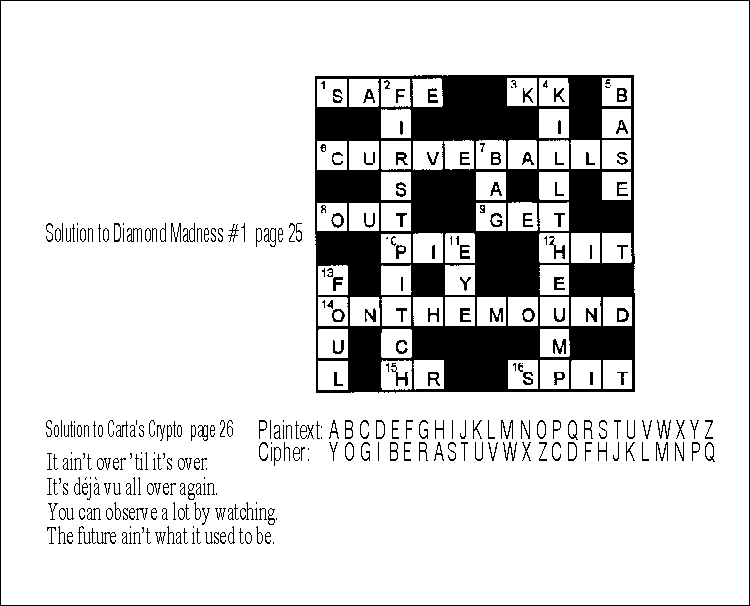

<nav class="breadcrumb" aria-label="breadcrumbs">
  <ul>
    <li><a href="{{ site.url }}{{ site.baseurl }}/index.html">Home</a></li>
    <li><a href="../magazine-home.html">Magazine</a></li>
    <li><a href="bi_vol_1_no_2_home.html">Vol. 1, No. 2 - September 2000</a></li>
    <li class="is-active"><a href="#" aria-current="page">Puzzle Answers</a></li>
  </ul>
</nav>

<section class="storycontent">
  <h1>Puzzle Answers</h1>
  
</section>
