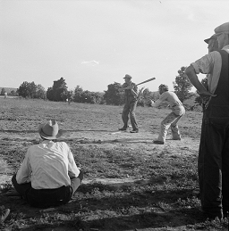

<nav class="breadcrumb" aria-label="breadcrumbs">
  <ul>
    <li><a href="{{ site.url }}{{ site.baseurl }}">Home</a></li>
    <li><a href="../magazine-home.html">Magazine</a></li>
    <li><a href="bi_vol_2_no_1_home.html">Vol. 2, No. 1 - June 2001</a></li>
    <li class="is-active"><a href="#" aria-current="page">Cow Pasture Baseball</a></li>
  </ul>
</nav>

<section class="storycontent">
  <h1>Cow Pasture Baseball</h1>
  
<em>by Bill Raven</em>

  

    I was playing shortstop. The batter hit a sharp grounder to my right, I dug it out of the dirt infield, set myself, and threw it six feet over the out stretched glove of the first baseman, who happened to be my older brother.
  

  

    The years were 1946, 1947, and 1948. World War II had been won, and the surviving veterans were home and attending school, working at jobs in the area, or farming.
  

  

    The area was central Kansas. We lived in or near small towns of 600 or so, surrounded by farms. These towns were formed six to eight miles apart as the railroads were built east to west in the 1880s and gave the surrounding farmers access to retail stores and transportation.
  

  

    The playing season, of course, was summer. The temperature was in the 90s with high humidity. It was HOT! Few homes had air conditioning. Businesses might have had some form of crude air conditioning.
  

  

    The games were played on Sunday afternoons. Most people went to church on Sunday morning. Sunday afternoon activities included driving around, visiting, attending movies, and, yes, watching cow pasture baseball. Practices were held Wednesday early evening after work hours.
  

  

    The players were World War II veterans in their early 20s, a few high school players like myself, and men who had been too old to serve. At times, the teams had difficulty in getting enough players to compete. Many of the better athletes from small towns played for teams sponsored by larger cities.
  

  

    The opposition consisted of teams from other nearby small towns. Occasionally, we would play a practice game against a larger city's team.
  

  

    The games were usually played on high school fields. The infield would be dirt, but groomed. The outfield would be mowed grass. Sometimes, the outfield would also be used as a pasture for feeding cows. Hence, the term "cow pasture baseball." Naturally, there would be cow "residue." The outfielders would scout their areas for such "residue."
  

  

    Umpires were recruited from spectators and literally were begged to serve since the job was not always an enjoyable one. One was behind the plate, and the other behind second base. They enforced the rules as best they knew. However, there was the occasional argument.
  

  

    The spectators were locals who would park their cars around the field and watch from these cars or on lawn chairs in front of the cars. Old retired men would sit together to watch the game. The home team would take a collection to cover expenses. The contributions would be pennies, nickels, and dimes.
  

  

    Concerning the game, then as now, pitching was the most important element. The better pitchers were recruited to play on larger city teams, so usually two or more pitchers would be used. Rules were stretched a bit so that a player could play a non-pitching position, pitch a few innings, and then return to his position. Scores were usually in the 14 to 12 range, so games tended to be long.
  

  

    The team had uniforms for most players, but many players wore the farm uniform:  overalls.
  

  

    We played the game to the best of our abilities and according to the rules. Occasionally, great plays were made, but always, we tried. When the game was over, we shook hands with the other team, were happy to win, regretted losing, and went on with our lives.
  

  

    This was cow pasture baseball, fun, simple, basic Americana.
  

  

    I was playing shortstop. The batter hit a sharp grounder to my right, I dug it out of the dirt infield, set myself, and threw a perfect strike to the first baseman, throwing the runner out by a clean half step, a routine Marty Marion play. I tried not to smile.
  

</section>
