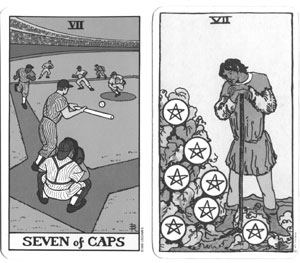

<nav class="breadcrumb" aria-label="breadcrumbs">
  <ul>
    <li><a href="{{ site.url }}{{ site.baseurl }}/index.html">Home</a></li>
    <li><a href="../magazine-home.html">Magazine</a></li>
    <li><a href="bi_vol_2_no_1_home.html">Vol. 2, No. 1 - June 2001</a></li>
    <li class="is-active"><a href="#" aria-current="page">Tarot and Baseball, Part 1</a></li>
  </ul>
</nav>

<section class="storycontent basic-table">
  <h1>Tarot and Baseball, Part 1</h1>
  <h2>- covering the bases -</h2>
  
<em>by Kerri S. McIntire</em>

  

    <figure class="float-left">
      
      <figcaption class="has-text-centered">
        Seven of Caps
      </figcaption>
    </figure>
    Using the Internet as my research tool, I discovered no less than three Tarot card decks inspired by the Great American Pastime. These are the <strong>Tarot of Baseball </strong>(U. S. Games Inc.) by Beverly Ransom and Robert Kasher, the <strong>Baseball Tarot</strong> (Workman Publishing) by Laura Philips and Mark Lerner, and the <strong>Tarot de Cooperstown</strong> by Jim Markowich and Paul Kuhrman.
  

  

    Before offering a review, I want to briefly explain to you what a Tarot deck is. In many ways, it's like a standard pack of playing cards. It has 40 <strong>minor arcana</strong>, or <strong>"pip"</strong>cards, which are numbered from ace to ten, in four suits. These four suits correspond to clubs, hearts, spades and diamonds. There are 16 <strong>court cards</strong>, four for each suit. They usually are called King, Queen, Knight, and Page. A Tarot deck has 22 additional <strong>major arcana</strong> cards. These have names like <em>The Lovers</em>, <em>Death</em> and <em>Judgment</em>, and are the ones most people associate with a Tarot reading.
  

  

    There are 78 cards in a Tarot deck, and each has its own meaning. Some say the Tarot is actually a sacred picture book, and the cards are its pages. The story is about humanity's experiences on the path to spiritual fulfillment. The Tarot puts them into four categories:
  

  

    <strong>Disks</strong> (diamonds) = physical experiences 
    <strong>Swords</strong> (spades) = mental experiences 
    <strong>Cups</strong> (hearts) = emotional experiences 
    <strong>Wands</strong> (clubs) = creative experiences 
  

  

    The <strong>minor arcana cards </strong>reveal how experiences manifest in situations. Aces are about focused energy. The <em>Ace of Cups</em> is true love, and the <em>Ace of Wands</em> is pure inspiration.
  

  

    <strong>Court cards</strong> reveal how experiences manifest in behavior. The <em>King of Disks</em> is a strong display of worldly influence, and the <em>Knight of Swords</em> is a daring expression of ideas.
  

  

    Although they also represent experiences, the <strong>major arcana</strong> cards do not follow suits. Their concepts are bigger than any situation or behavior. In baseball terms, if the minor arcana cards are the plays and court cards and the players, then the 22 <strong>major arcana</strong> cards are the overall dynamics of the game.
  

  

    And now that I've begun the baseball analogies, I want to praise the <strong>Tarot of Baseball</strong>, the<strong> Baseball Tarot</strong>, and the <strong>Tarot de Cooperstown</strong> for being great comparative studies of two very complex concepts. The Tarot and baseball <em>can</em> be linked, and linked so well that there is room for all three interpretations. No one is particularly best, so I will focus my review on discussing individual strengths and weaknesses.
  

  

    I'll begin with the names of the four suits:
  

  <table>
    <tr><th>Traditional</th><th>Baseball Tarot</th><th>Tarot of Baseball</th><th>T. de Cooperstown</th></tr>
    <tr><td>Wands (fire)</td><td>Bats</td><td>Bats</td><td>Bats</td></tr>
    <tr><td>Cups (water)</td><td>Mitts</td><td>Gloves</td><td>Gloves</td></tr>
    <tr><td>Swords (air)</td><td>Balls</td><td>Balls</td><td>Bases</td></tr>
    <tr><td>Disks (earth)</td><td>Bases</td><td>Caps</td><td>Balls</td></tr>
  </table>
  
   

  

    All three decks use <strong>Bats</strong> for <strong>Wands</strong>&mdash;the <em>fire</em> suit symbolizing creative experiences. The Wand is a lightning rod that absorbs power from without and uses it to spark power from within. The bat is the instrument by which a hitter can channel the energy of a pitched ball into an expression of his or her own inner individual force.
  

  

    All the decks use a <strong>Glove</strong>, or <strong>Mitt</strong>, for <strong>Cups</strong>. This is fitting, as the <em>water</em> suit symbolizes emotional experiences like receptivity, flexibility and relating. The catcher is clearly in a receptive relationship with the pitcher. The fielders, too, are in a position of receiving and cooperation. It is the give-and-take interplay of gloves that creates a team.
  

  

    For <strong>Swords</strong>, the suit of mental experiences, the decks disagree. <strong>Balls </strong>do seem better than <strong>Bases</strong> for representing the element of <em>air</em>, and a lot strategy lies in how the ball is pitched, hit or fielded. But this suit is about maneuvering for an advantage. Runners try to win the bases, and fielders try to defend them. This is baseball's true match of wits and agility.
  

  

    The decks also disagree on <strong>Disks</strong>. This is the suit of <em>earth</em> experiences, and so <strong>Bases</strong> are the natural symbol. <strong>Balls</strong> work well visually, as they are disk-shaped in two-dimensional drawings. But the most interesting icon to me is <strong>Caps</strong>. Baseball caps sport the team logo and franchise name--those things that give a ball player worldly sustenance and identity.
  

  

    Now I'll discuss how each deck presents the <strong>minor arcana cards</strong>--the aces through tens of each suit. I'll begin with the <strong>Tarot of Baseball</strong>, created by Robert Kasher, drawn by Beverly Ransom, and published by U. S. Games Systems, Inc. of Stamford, Connecticut.
  

  

    Remember that the minor arcana cards reveal how experiences are mirrored in situations. The <strong>Tarot of Baseball</strong> pictures how those situations might translate to baseball--both on and off the field. Artist Beverly Ransom imitates illustrations created by Pamela Colman Smith. Smith and writer Arthur Edward Waite collaborated on a Tarot deck published in the 1950s. The Waite-Smith deck, first used as a study guide by the magical Order of the Golden Dawn, has become a standard source for Tarot designs.
  

  

    A great example of how the <strong>Tarot of Baseball</strong> incorporates a Waite-Smith design into its cards is the <em>Five of Gloves</em>. Here, three fielders have come up empty on a hit ball and two others are still looking to catch it. Waite-Smith's <em>Five of Cups</em> card has three spilled cups representing loss, and two full cups representing hope. The dark central figure of Waite-Smith is replaced here with a black-coated umpire.
  

  

    Another card that does a particularly good job of reflecting the Waite-Smith design is the <em>Eight of Bats</em>. This card, which pertains to the arrival of inspiring messages, is unusual in the Waite-Smith deck in it that it has no human figures. It shows eight suspended Wands on their way to a destination. The <strong>Tarot of Baseball</strong> translates this into bats hanging on a dugout rack. What a great symbol for the scoring potential of a baseball game!
  

  

    The <strong>Tarot of Baseball</strong> incorporates many clever uses of the symbols. A good example is the <em>Four of Balls</em>. Traditionally, this is the <em>Four of Swords</em>, and it signifies a forced period of rest to be used for meditation. Waite-Smith shows the figure of a knight in an attitude of prayer, stretched out on his tomb. The<strong> Tarot of Baseball</strong> shows the prone figure as a despondent pitcher who's been pulled for giving too many walks--thus the <em>Four of Balls</em>.
  

  

    Not all the imagery in the <strong>Tarot of Baseball</strong> is borrowed from Waite-Smith. The suit of <em>Caps</em> is totally original in its presentation, and is my favorite for turning the ball diamond into a stage for life's situations. The <em>Seven of Caps</em> depicts a suicide squeeze, an unusual play for advancing a run home. In traditional Tarot, the <em>Seven of Disks</em> represents a time when innovative risks are needed to jump-start a successful but languishing enterprise.
  

  

    In the traditional Tarot, each suit has a King, Queen, Knight and Page. The sixteen <strong>court card</strong>s of the <strong>Tarot of Baseball</strong> appropriately reflect these designations. They go like this:
  

  

    Kings (commanding on the good side, tyrannical on the bad side) = Managers 
    Queens (nurturing on the good side, manipulative on the bad side) = Coaches 
    Knights (brilliant on the good side, unpredictable on the bad side) = Pitchers 
    Pages (reliable on the good side, unyielding on the bad side) = Umpires 
  

  

    The <strong>Tarot of Baseball </strong>focuses on the Major League, so it shows only men participating. The male coach is an excellent choice for what is in essence a feminine card. The <em>Coach of Bats</em> works with players to improve their hitting. Drawing the <em>Queen of Wands</em> from a Tarot deck can indicate a focus on working with creative expression.
  

  

    But for a few notable exceptions, the illustrations here don't rely on Waite-Smith designs. Instead, unique staging reinforces the role of the main figure. For example, the <em>Manager of Balls</em> is shown "cutting" a pitcher. This is the perfect representation of how the <em>King of Swords</em> would behave in baseball. He wields the ultimate authoritative judgment, and doesn't hesitate to sacrifice the one to benefit the many.
  

  

    When the imagery does follow Waite-Smith, it actually seems inappropriate. The <em>Pitcher of Gloves</em> has wings on his cap to mimic the <em>Knight of Cups</em>. Stranger still is the fish that is flopped on the baseline in the <em>Umpire of Gloves</em>. I know it is a nod to the <em>Page of Cups</em>, but touches like this don't add to the meaning of the card, and just look arbitrary to me.
  

  

    The <strong>major arcana</strong> are the final cards to review from the <strong>Tarot of Baseball</strong>. Traditional Tarot thought puts these 22 cards on an even more symbolic level than the minor arcana and court cards. For example, the <em>Five of Wands</em> (Bats) represents an experience where aggression mixes with sport. This experience is an actual incident, perceived in real time.
  

  

    The <em>Knight of Disks</em> (Pitcher of Caps) represents a behavior having to do with seeking stability, but doing so in a rather daring manner. This behavior, too, manifests itself in a particular way and time, and usually in a particular person.
  

  

    In other words, the minor arcana and court cards symbolize experiences and behaviors to which we can draw specific reference at a certain point in our lives. The major arcana cards, though, represent concepts larger than any one experience or behavior. In baseball terminology, they describe the overall dynamics of the sport and the energy it generates.
  

  

    The <strong>Tarot of Baseball</strong> takes an effective line on this by casting baseball "icons" as the major arcana. These are generic team members like <em>The Pinch Hitter</em>, generic on-field incidents like <em>The Falling Outfielder</em>, and generic off-field personalities like <em>The Owner</em>. Generic not because they are bland, but because they are <em>universal to the game</em>.
  

  

    <em>Justice</em> is one of the major arcana cards of the Tarot. It signifies equity, rightness, probity and making the call about what is true. The <strong>Tarot of Baseball</strong> has <em>The Umpire </em>as<em> Justice</em>. If you'll remember, umpires appear in this same deck as <em>Pages</em>. Those umpires represent specific behaviors. <em>The Umpire</em> is an <em>overall symbol</em> for the concept of justice in baseball.
  

  

    Robert Kasher writes it meaning as:
  

  

  Upright: <em>An inability to be corrupted by the pressures of the game.</em>
  

  

    Reverse: <em>Too quick in judgment. Injustice.</em>
  

  

    <em>Judgment</em> is also a card in the traditional major arcana. <em>Judgment</em> differs from <em>Justice</em> in the same way that heavenly review differs from earthly law. It is the "higher court" with a wider interpretation of truth. I like that Robert Kasher has <em>The Sportscaster</em> as <em>Judgment</em>. His meaning for it is:
  

  

    Upright: <em>Awareness of the team's good points and bad points. Objectivity.</em>
  

  

    Reverse: <em>Disillusionment, vindictiveness.</em>
  

  

    The major arcana cards of the <strong>Tarot of Baseball</strong> pay clever homage to Waite-Smith both in design and meaning. I'll end with my favorite: <em>The Hanged Man</em> as <em>The Hung-up Man</em>.
  

  

    Notice how Beverly Ransom crossed the legs here in the traditional manner, and how she located the stadium lights to imitate the tree. Robert Kasher's translation of it as "dawning wisdom, hard won experience" is also commendable. <em>The Hanged Man</em> is too often seen as a negative card. While it may be true that the present circumstances are disorienting or uncomfortable, the final outcome is always enlightenment.
  

  

    I hope you've been enlightened (without too much suffering!) by this article. Please look for my review of <strong>The Baseball Tarot</strong> (Workman Publishing) by Laura Philips and Mark Lerner in the next issue of Baseball Ink.
  

  

    Thank you again Robert Kasher and Beverly Ransom for a great deck.
  

  

    The Waite-Smith examples are also from a deck published by U. S. Games Systems, Inc
  

  

  

  Kerri McIntire is a Tarot enthusiast who saw a future in working with the past. She and her better half Dave Buckhout run </em>InHeritage<em>, an Internet design company specializing in historical presentations. For more information, visit <a href="http://www.inheritage.org"></em>www.inheritage.org<em></a>.
  

</section>
