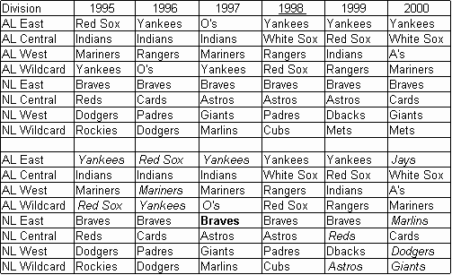

<nav class="breadcrumb" aria-label="breadcrumbs">
  <ul>
    <li><a href="{{ site.url }}{{ site.baseurl }}">Home</a></li>
    <li><a href="../magazine-home.html">Magazine</a></li>
    <li><a href="bi_vol_2_no_2_home.html">Vol. 2, No. 2 - September 2001</a></li>
    <li class="is-active"><a href="#" aria-current="page">Emphasizing Division Records</a></li>
  </ul>
</nav>

<section class="storycontent">
  <h1>Emphasizing Division Records</h1>
  
<em>by Dave Quinn</em>

  

    Earl Weaver used to say that to win you have to split with your own division and clean up on the other division. While this worked for Earl for many years, something seems wrong about this approach. The division winner should be the team that played the best against its division foes. The division record should decide the division winner, with the overall record acting as the tiebreaker.
  

  

    With the move to the unbalanced schedule (or the return to it in the NL) and a wildcard team in the playoff, division records could become the deciding factor for who wins the division. The wildcard team would be the team with the best overall record that did not win the division.
  

  

    One of the arguments used by some owners for the balanced schedule was they want big name teams like the Yankees and Red Sox to visit more often since they draw bigger crowds. With an emphasis on division records, a Twins-Royals game becomes more meaningful and likely to draw a bigger crowd. The unbalanced schedule provides for the opportunity to reinforce divisional rivalries.
  

  

    If division records were used the last ten years to decide division winners and wildcard teams, there would have been some major changes in the playoffs. The two tables below show the years that division records would have made a difference in determining division winners and wildcard teams. Table 1 shows years 1995-2000, and Table 2 shows 1990-93. 1994 was not used since there were no playoffs that year.
  

  <h2>Table 1: Seasons 1995-2000</h2>
  

    
  

  <h2>Table 2: 1990-1993</h2>
  

    
  

  

    Years 1992, 1993, and 1998 are underlined because there was no difference those years. The differences in the other years are shown in italics. Bolded names are teams that tied for the division but made the playoffs based on having a better overall record.
  

  

    The impact of this system would have gone beyond who made the playoffs and who didn't. The Twins would have missed out on their "worst to first" season in 1991 because they would not have made the playoffs. There would not have been a "Subway Series" in 2000 because neither the Yankees nor the Mets would have seen the postseason. The Reds would not have been the 1990 World Champs. The baseball world would have been all a buzz about the 1997 Marlins finishing third in the NL East but getting the wildcard position for having the best overall record.
  

  

    This concept is not so far-fetched. In many college sports, a team's conference record is more important than its overall record. The conference record determines seeding in the season-end tournament. Not too long ago in college basketball, the conference record determined several conferences' representatives in the NCAA tournament.
  

  

    Baseball could take a major step forward in creating more divisional rivalries by changing how teams qualify for the playoffs. Division records should determine division winners. The overall record should be used for determining the wildcard team and for breaking ties in division winners.
  

</section>
